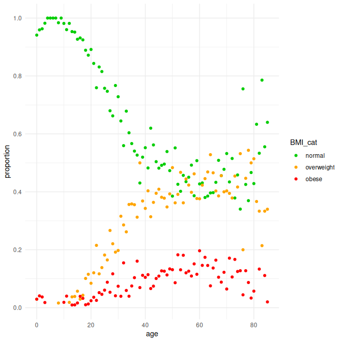
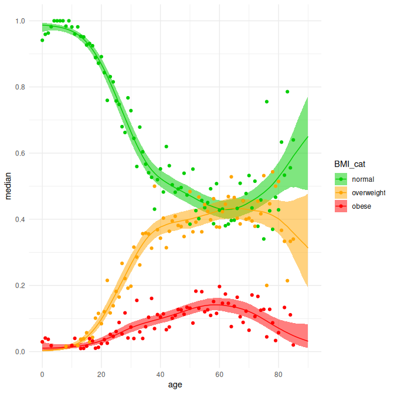
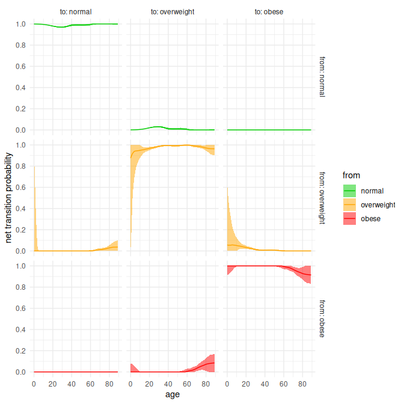

Estimating net transition probabilities from cross-sectional data
================

- <a href="#abstract" id="toc-abstract">Abstract</a>
- <a href="#worked-example" id="toc-worked-example">Worked example</a>
  - <a href="#initial-things" id="toc-initial-things">Initial things</a>
  - <a href="#data-preparation" id="toc-data-preparation">Data
    preparation</a>
  - <a href="#fit-multinomial-p-splines"
    id="toc-fit-multinomial-p-splines">Fit multinomial P-splines</a>
  - <a href="#predict-age-specific-prevalences"
    id="toc-predict-age-specific-prevalences">Predict age-specific
    prevalences</a>
  - <a href="#calculate-net-transition-probabilities"
    id="toc-calculate-net-transition-probabilities">Calculate net-transition
    probabilities</a>

On this repository you find a worked example and can download R code
with example data belonging to the paper:

[Estimating net transition probabilities from cross-sectional data with
application to risk factors in chronic disease
modeling](http://onlinelibrary.wiley.com/doi/10.1002/sim.4423/abstract;jsessionid=F435B3B17F6562DEBED2BE52BAB83F54.f04t02).
<u>J van de Kassteele</u>, RT Hoogenveen, PM Engelfriet, PHM Van Baal,
HC Boshuizen. *Statistics in Medicine*, 2012, **31** (6) , 533–543.

#### Abstract

A problem occurring in chronic disease modeling is the estimation of
transition probabilities of moving from one state of a categorical risk
factor to another. Transitions could be obtained from a cohort study,
but often such data may not be available. However, under the assumption
that transitions remain stable over time, age specific cross-sectional
prevalence data could be used instead. Problems that then arise are
parameter identifiability and the fact that age dependent
cross-sectional data are often noisy or are given in age intervals. In
this paper we propose a method to estimate so-called net annual
transition probabilities from cross-sectional data, including their
uncertainties. Net transitions only describe the net inflow or outflow
into a certain risk factor state at a certain age. Our approach consists
of two steps: first, smooth the data using multinomial P-splines,
second, from these data estimate net transition probabilities. This
second step can be formulated as a transportation problem, which is
solved using the simplex algorithm from linear programming theory. A
sensible specification of the cost matrix is crucial to get meaningful
results. Uncertainties are assessed by parametric bootstrapprevng. We
illustrate our method using data on body mass index. We conclude that
this method provides a flexible way of estimating net transitions and
that the use of net transitions has implications for model dynamics, for
example when modeling interventions.

## Worked example

### Initial things

First we need to load some packages. If you don’t have them, install
them first using the `install.packages` function.

``` r
# Load packages
library(tidyverse)
library(mgcv)
library(lpSolve)
```

Next, we import the data. Here we use the `data_bmi.csv` on the Dutch
males ages 0-85 in 2006 and 2007 (POLS survey). The data are available
on this GitHub repository.

``` r
# Read BMI data of Dutch males aged 0-85 in 2006/2007
data_bmi <- read_csv(
  file = "data_bmi.csv",
  show_col_types = FALSE)

# Show data_bmi
print(data_bmi)
```

    # A tibble: 86 × 4
         age normal overweight obese
       <dbl>  <dbl>      <dbl> <dbl>
     1     0     32          1     1
     2     1     47          0     2
     3     2     52          0     2
     4     3     55          0     1
     5     4     46          0     0
     6     5     68          0     0
     7     6     59          0     0
     8     7     53          0     0
     9     8     61          1     0
    10     9     40          0     0
    # … with 76 more rows

We see that `data_bmi` has four columns: `age` and the three BMI
categories: `normal`, `overweight`, `obese`. The numbers are counts. The
data are organized in wide format.

### Data preparation

For our calculations we need them in long format (i.e. tidy format).
More specifically, we need to have the data at the individual level,
where each person gets one record with `age` and its BMI category. So 32
records with `age = 0` and `BMI_cat = normal`, 1 record with `age = 0`
and `BMI_cat = overweight`, etc.

We use the `prevvot_longer` function to reshape the data from wide to
long format. However, the counts are still aggregated then. Therefore we
apply the `uncount` function to expand the records to the individual
level.

``` r
data_bmi <- data_bmi |>
  # Reshape data_bmi into long format
  pivot_longer(
    cols = c(normal, overweight, obese),
    names_to = "BMI_cat",
    values_to = "count") |> 
  # Uncount the counts
  uncount(
    weights = count)

# Check by counting them again
data_bmi |> 
  count(
    age, BMI_cat)
```

    # A tibble: 239 × 3
         age BMI_cat        n
       <dbl> <chr>      <int>
     1     0 normal        32
     2     0 obese          1
     3     0 overweight     1
     4     1 normal        47
     5     1 obese          2
     6     2 normal        52
     7     2 obese          2
     8     3 normal        55
     9     3 obese          1
    10     4 normal        46
    # … with 229 more rows

We notice that `obese` is before `overweight`, according to the
alphabet. We turn `BMI_cat` into a factor (categorical variable) having
the levels in the correct order for the calculations. There is no need
to arrange the records afterwards, but just for clarity.

``` r
# Make BMI_cat a factor with levels normal, overweight and obese
data_bmi <- data_bmi |>
  mutate(
    BMI_cat = BMI_cat |> 
      factor(levels = c("normal", "overweight", "obese"))) |> 
  arrange(
    age, BMI_cat)

# Check
data_bmi |>
  count(
    age, BMI_cat)
```

    # A tibble: 239 × 3
         age BMI_cat        n
       <dbl> <fct>      <int>
     1     0 normal        32
     2     0 overweight     1
     3     0 obese          1
     4     1 normal        47
     5     1 obese          2
     6     2 normal        52
     7     2 obese          2
     8     3 normal        55
     9     3 obese          1
    10     4 normal        46
    # … with 229 more rows

It may seem that nothing has changed, but note that `BMI_cat` is now a
factor instead of a character data type.

We visualize the raw data. First we normalize the counts to proportions,
so they add up to one for each age. This is just for plotting.

``` r
# Normalize counts to proportions
data_bmi_plot <- data_bmi |> 
  count(
    BMI_cat, age) |> 
  group_by(
    age) |> 
  mutate(
    proportion = n/sum(n))
```

``` r
# Make the plot
ggplot() +
  geom_point(
    data = data_bmi_plot,
    mapping = aes(
      x = age,
      y = proportion,
      colour = BMI_cat)) +
  # Set better breaks for both axes
  scale_x_continuous(
    breaks = seq(from = 0, to = 90, by = 20),
    minor_breaks = seq(from = 0, to = 90, by = 10)) +
  scale_y_continuous(
    breaks = seq(from = 0, to = 1, by = 0.2),
    minor_breaks = seq(from = 0, to = 90, by = 0.1)) +
  # Use suggestive colours
  scale_colour_manual(
    values = c("green3", "orange", "red")) +
  # Minimal theme
  theme_minimal()
```



We see that the number of people with normal BMI decreases with age,
while the proportions of the other two BMI classes increase with age.

### Fit multinomial P-splines

In order to estimate the net transition probabilties, we need to have
smooth estimates of the age-specific prevalences for each BMI category.
We use the `gam` function from the `mgcv` package with a multinomial
likelihood.

Looking at `help(multinom)`, we see that we need to translate the factor
levels of `BMI_cat` into integers 0, 1 or 2, where 0 corresponds to the
reference category.

``` r
# Create new variable BMI_int
# 0 = normal, 1 = overweight, 2 = obese
data_bmi <- data_bmi |>
  mutate(
    BMI_int = BMI_cat |> 
      as.integer() |>
      (`-`)(1))
```

Each category gets its own P-spline (`bs = "ps"`). Because the third
category is one minus the sum of the others, we only need to specify two
smooths of `age`. We specify this as a list in the `formula` argument.
We must choose `k` large enough to allow enough flexibility, the penalty
does the rest. `k = 15` is large enough here.

In the `family` argument, we need to specify the number of categories,
counting from 0. As we have three categories, we specify
`family = multinom(K = 2)`. Also see `help(gam)`, `help(smooth.terms)`
and `help(multinom)` in the `mgcv` package.

Because of the `method = REML` smoothing parameter estimation, the
result is somewhat different from the fit in the paper (there we use the
BIC).

``` r
# Fit multinomial P-splines to data_bmi
gam_bmi <- gam(
  formula = list(
    BMI_int ~ s(age, bs = "ps", k = 15),
    ~ s(age, bs = "ps", k = 15)),
  family = multinom(K = 2),
  data = data_bmi,
  method = "REML")
```

We have a brief look at the summary:

``` r
# Show summary of model fit
gam_bmi |> 
  summary()
```


    Family: multinom 
    Link function: 

    Formula:
    BMI_int ~ s(age, bs = "ps", k = 15)
    ~s(age, bs = "ps", k = 15)

    Parametric coefficients:
                  Estimate Std. Error z value Pr(>|z|)    
    (Intercept)   -1.09514    0.04843  -22.61   <2e-16 ***
    (Intercept).1 -2.13204    0.05623  -37.91   <2e-16 ***
    ---
    Signif. codes:  0 '***' 0.001 '**' 0.01 '*' 0.05 '.' 0.1 ' ' 1

    Approximate significance of smooth terms:
               edf Ref.df Chi.sq p-value    
    s(age)   6.037  7.241  549.3  <2e-16 ***
    s.1(age) 5.368  6.498  244.7  <2e-16 ***
    ---
    Signif. codes:  0 '***' 0.001 '**' 0.01 '*' 0.05 '.' 0.1 ' ' 1

    Deviance explained = 11.6%
    -REML = 1156.1  Scale est. = 1         n = 7214

We have fitted two intercepts and two spline curves, the third category
(here the reference category) follows naturally from the other two. Both
spline terms are highly significiant, as can be expected from the figure
above.

### Predict age-specific prevalences

We can now predict smooth age-specific prevalances and use these to
estimate the net transition probabilities between the classes.

We have two options:

1.  Include the uncertainties
2.  Ignore the uncertainties

Option 2 is fast and easy and is mostly used for practical applications.
The code below runs for both options, but there is an additional step if
you want to ignore the uncertainties.

First the set-up:

``` r
# Set age range to make predictions for
age_pred <- 0:90
n_pred <- length(age_pred)

# Set the number of categories, here 3
k <- 3

# Set the number of Monte Carlo simulations
# n_sim should be large enough, preferably 5000 to obtain stable 95% confidence intervals
# Note that n_sim will be set to 1 later on if you do not want uncertainties
n_sim <- 1000
```

Now we extract the spline coefficients and their covariance matrix from
the `gam_bmi` model object:

``` r
# Extract spline coefficients and covariance matrix of spline coefficients
beta <- coef(gam_bmi)
V_beta <- vcov(gam_bmi)
n_beta <- length(beta)/(k - 1) # Length of coefficient vector for each category
```

Next, create the corresponding model matrix (linear predictor matrix)
from the `gam_bmi` model object to use in the predictions:

``` r
# Create model matrix for age_pred based on the gam_bmi object
X <- predict(
  object = gam_bmi,
  newdata = tibble(age = age_pred),
  type = "lpmatrix")
```

Unfortunately, this is not very useful for making multinomial
predictions. We have to create a block-diagnoal version of it.

``` r
# Create a block diagonal matrix version of X
X_bd <- matrix(0, nrow = n_pred*(k - 1), ncol = n_beta*(k - 1))
for (i in seq_len(k - 1)) {
  X_bd[seq_len(n_pred) + (i - 1)*n_pred, seq_len(n_beta) + (i - 1)*n_beta] <-
    X[seq_len(n_pred), seq_len(n_beta) + (i - 1)*n_beta]
}
```

Now we are all set and arrive at the point where we have to choose to
include uncertainties or not.

For including uncertainties, sample `n_sim` realisations for the
coefficients, run the block of code below:

``` r
# INCLUDE UNCERTAINTIES
# Generate n_sim realisations of the coefficients
beta_sim <- rmvn(n = n_sim, mu = beta, V = V_beta)
```

For not including uncertainties, run the block of code below. It sets
`n_sim` to 1 and sets `beta_sim` to `beta`.

``` r
# DO NOT INCLUDE UNCERTAINTIES
# Only one realisation of the coefficients: beta
n_sim <- 1
beta_sim <- t(beta)
```

Calculate the linear predictor `eta` for all categories. It The zero
matrix is reference category. This is how multinomial prediction works.

``` r
# Calculate the linear predictor for all categories
eta <- rbind(
  matrix(0, nrow = n_pred, ncol = n_sim),
  tcrossprod(X_bd, beta_sim))
```

`eta` is a `n_pred*k` x `n_sim` matrix. To calculate the prevalences,
convert it to a `n_pred` x `k` x `n_sim` array:

``` r
# Convert matrix eta to an array
eta <- array(eta, dim = c(n_pred, k, n_sim))
```

The prevalences are now calculated using the inverse multinomial logit
link function. This results in a `n_pred` x `k` x `n_sim` array `prev`:

``` r
# Calculate prevalences from eta using the inverse multinomial logit link function
exp_eta_sum <- apply(X = exp(eta), MARGIN = c(1, 3), FUN = sum)
prev <- array(0, dim = c(n_pred, k, n_sim))
for (i in 1:k) {
  prev[, i, ] <- exp(eta[, i, ])/exp_eta_sum
}
```

We can plot the result. Therefore we have to calculate some statistics:
the median, and the 95% confidence interval. The array permutation puts
things in the right order before passing it into a `n_pred*k` x 3
matrix.

``` r
# Calculate summary statitics
prev_stat <- prev |> 
  apply(MARGIN = 1:2, FUN = quantile, probs = c(0.5, 0.025, 0.975)) |> 
  aperm(c(2, 3, 1)) |> 
  matrix(
    nrow = n_pred*k,
    ncol = 3,
    dimnames = list(NULL, c("median", "lower", "upper")))
```

We create a new tibble `newdata_bmi` containing the `BMI_cat` and `age`
to make the plot for. We add `prev_stat` to it.

``` r
# Create new data with BMI categories and ages
# Add prev_stat
newdata_bmi <- bind_cols(
  expand_grid(
    BMI_cat = levels(data_bmi$BMI_cat) |> fct_inorder(),
    age = age_pred),
  prev_stat)

# Show newdata_bmi
print(newdata_bmi)
```

    # A tibble: 273 × 5
       BMI_cat   age median lower upper
       <fct>   <int>  <dbl> <dbl> <dbl>
     1 normal      0  0.987 0.967 0.994
     2 normal      1  0.986 0.969 0.993
     3 normal      2  0.986 0.970 0.992
     4 normal      3  0.985 0.971 0.991
     5 normal      4  0.983 0.971 0.990
     6 normal      5  0.982 0.970 0.989
     7 normal      6  0.980 0.969 0.987
     8 normal      7  0.978 0.967 0.985
     9 normal      8  0.976 0.965 0.983
    10 normal      9  0.973 0.961 0.980
    # … with 263 more rows

Make the plot. Similar to the one before, but now with the fit added to
it.

``` r
# Make the plot
ggplot() +
  geom_ribbon(
    data = newdata_bmi,
    mapping = aes(x = age, ymin = lower, ymax = upper, fill = BMI_cat),
    colour = NA,
    alpha = 0.5) +
  geom_line(
    data = newdata_bmi,
    mapping = aes(x = age, y = median, colour = BMI_cat)) +
  geom_point(
    data = data_bmi_plot,
    mapping = aes(
      x = age,
      y = proportion,
      colour = BMI_cat)) +
  # Set better breaks for both axes
  scale_x_continuous(
    breaks = seq(from = 0, to = 90, by = 20),
    minor_breaks = seq(from = 0, to = 90, by = 10)) +
  scale_y_continuous(
    breaks = seq(from = 0, to = 1, by = 0.2),
    minor_breaks = seq(from = 0, to = 90, by = 0.1)) +
  # Use suggestive colours
  scale_fill_manual(
    values = c("green3", "orange", "red")) +
  scale_colour_manual(
    values = c("green3", "orange", "red")) +
  # Minimal theme
  theme_minimal()
```



This looks good. Note the slight differences with the original Figure 1
in the paper. This is because of the use of `gam` with `method = REML`
smoothing parameter estimation.

### Calculate net-transition probabilities

From the smooth prevalences in `prev` array, we can estimate the
net-transition probabilities.

First, we define a function for solving transportation problems using
the simplex algorithm. It takes almost the same arguments as `lp` from
the `lpSolve` package. See `help(lp)`

``` r
# Function for solving transportation problems using the simplex algorithm
transport_simplex <- function(supply, demand, cost, k) {
  # Input:
  # supply = k x 1 vector with supplies
  # demand = k x 1 vector with demands
  # cost   = k x k matrix with shipprevng costs
  # k      = number of categories
  
  # Output:
  # trans = k x k matrix with transitions
  
  # Solve
  sol <- lp(
    objective.in = as.vector(cost),
    const.mat = rbind(
      t(kronecker(diag(k), rep(1, k))),
      t(kronecker(rep(1, k), diag(k)))),
    const.dir = rep("=", 2*k),
    const.rhs = c(supply, demand))
  trans <- sol$solution |> 
    matrix(
      nrow = k,
      ncol = k,
      byrow = TRUE)
  
  # Return output
  return(trans)
}
```

Now define the the cost matrix, a Toeplitz matrix, as in the paper:

``` r
# Define cost matrix
cost <- toeplitz(diffinv(seq_len(k - 1)))

# Print cost matrix
print(cost)
```

         [,1] [,2] [,3]
    [1,]    0    1    3
    [2,]    1    0    1
    [3,]    3    1    0

The cost matrix indicates that it takes no costs to stay in a given
category, that it takes 1 unit to go to a next category, and that it
takes 3 units to switch two categories, e.g. from the first to the third
category.

Now allocate two arrays `trans` and `trans_prob`. These will contain the
transitions between categories and the corresponding transition
probabilities.

``` r
# Allocate k x k x n_pred - 1 x n_sim arrays
trans      <- array(0, dim = c(k, k, n_pred - 1, n_sim))
trans_prob <- array(0, dim = c(k, k, n_pred - 1, n_sim))
```

Now we solve the transportation problem for each prediction. Obviously
this is for `n_pred` minus one predictions.

``` r
# Estimate transitions and transition probabilities
# Do this n_sim times. It takes a while if n_sim is large
for (i in 1:(n_pred - 1)) {
  # # Print progress (uncomment if needed)
  # cat("pred =", i, "\n")
  for (j in 1:n_sim) {
    # Transitions
    trans[, , i, j] <- transport_simplex(
      supply = prev[i, , j],
      demand = prev[i + 1, , j],
      cost = cost,
      k = k)
    # Transition probabilities
    trans_prob[, , i, j] <- t(trans[, , i, j]/prev[i, , j])
  }
}
```

Calculate the statistics for `trans_prob`: the median, and the 95%
confidence interval. Again, apply an array permutation for reordering of
the dimensions.

``` r
# Calculate summary statitics
trans_prob_stat <- trans_prob |> 
  apply(MARGIN = c(1, 2, 3), FUN = quantile, probs = c(0.5, 0.025, 0.975)) |> 
  aperm(c(4, 2, 3, 1)) |> 
  matrix(
    nrow = (n_pred - 1)*k*k,
    ncol = 3,
    dimnames = list(NULL, c("median", "lower", "upper")))
```

We create a new tibble `trans_prob_data` containing the `from` - `to`
transition probabilities for each `age`. We add `trans_prob_stat` to it.

``` r
# Create a tidy tibble with the transition probabilities for each age
trans_prob_data <- bind_cols(
  expand_grid(
    from = levels(data_bmi$BMI_cat) |> fct_inorder(),
    to = levels(data_bmi$BMI_cat) |> fct_inorder(),
    age = age_pred[-n_pred]),
  trans_prob_stat)

# Show trans_prob_data
print(trans_prob_data)
```

    # A tibble: 810 × 6
       from   to       age median lower upper
       <fct>  <fct>  <int>  <dbl> <dbl> <dbl>
     1 normal normal     0  0.999 0.999 1    
     2 normal normal     1  0.999 0.998 1    
     3 normal normal     2  0.999 0.998 1    
     4 normal normal     3  0.999 0.998 1    
     5 normal normal     4  0.999 0.998 1    
     6 normal normal     5  0.998 0.997 1.00 
     7 normal normal     6  0.998 0.997 0.999
     8 normal normal     7  0.997 0.996 0.999
     9 normal normal     8  0.997 0.996 0.998
    10 normal normal     9  0.996 0.995 0.997
    # … with 800 more rows

Finally, plot the result. The colouring is according to the `from`
category (rows).

``` r
# Make the mplot
ggplot(
  data = trans_prob_data,
  mapping = aes(x = age)) +
  geom_ribbon(
    mapping = aes(ymin = lower, ymax = upper, fill = from),
    colour = NA,
    alpha = 0.5) +
  geom_line(
    mapping = aes(y = median, colour = from)) +
  facet_grid(
    rows = vars(from),
    cols = vars(to),
    labeller = label_both,
    scales = "free") +
  # Set better breaks for both axes
  scale_x_continuous(
    breaks = seq(from = 0, to = 90, by = 20),
    minor_breaks = seq(from = 0, to = 90, by = 10)) +
  scale_y_continuous(
    breaks = seq(from = 0, to = 1, by = 0.2),
    minor_breaks = seq(from = 0, to = 90, by = 0.1)) +
  # Use suggestive colours
  scale_fill_manual(
    values = c("green3", "orange", "red")) +
  scale_colour_manual(
    values = c("green3", "orange", "red")) +
  # Other y-axis label
  labs(
    y = "net transition probability") +
  # Minimal theme
  theme_minimal()
```



The figure resembles Figure 2 from the paper, although the y-scales are
fixed here and confidence intervals are a bit wider.
